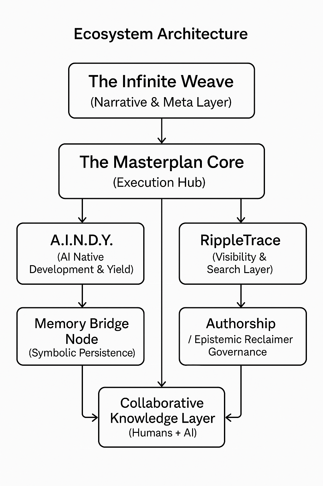

\# 🌐 Masterplan Infinite Weave  

\### The AI-Native Ecosystem of Shawn Knight  


---


\## 🧭 Overview  


\*\*Masterplan Infinite Weave (MPIW)\*\* is a living, AI-native knowledge and execution ecosystem — uniting technology, storytelling, and human potential through intentional architecture.  


This repository represents one active node of that system:  

\*\*A.I.N.D.Y. (AI Native Development and Yield)\*\* — the operational backend that transforms knowledge into measurable execution.  


Together, these systems form a recursive intelligence network that learns, adapts, and evolves — bridging \*narrative continuity\*, \*data persistence\*, and \*human progress\*.  


---

<p align="center">
  
  <br>
  <em>Figure 1 — Masterplan Infinite Weave Architecture: AI-Native System Layout</em>
</p>

---


\## 🧬 Ecosystem Architecture  


&nbsp;           ┌────────────────────────────┐

&nbsp;           │     The Infinite Weave     │

&nbsp;           │  (Narrative \& Meta Layer)  │

&nbsp;           └────────────┬───────────────┘

&nbsp;                        │

&nbsp;                        ▼

&nbsp;      ┌──────────────────────────────────────────┐

&nbsp;      │     The Masterplan Core (Execution Hub)   │

&nbsp;      └────────────────┬──────────────────────────┘

&nbsp;                       │

&nbsp;     ┌─────────────────┼─────────────────┐

&nbsp;     │                 │                 │

&nbsp;     ▼                 ▼                 ▼


┌─────────────┐ ┌──────────────┐ ┌──────────────┐

│ A.I.N.D.Y. │ │ RippleTrace │ │ Authorship │

│ (AI Native │ │ Visibility \& │ │ / Epistemic │

│ Development │ │ Search Layer │ │ Reclaimer │

│ \& Yield) │ │ │ │ Governance │

└─────┬───────┘ └──────┬───────┘ └──────┬───────┘

│ │ │

▼ ▼ ▼

┌─────────────┐ ┌────────────┐ ┌───────────────┐

│ Memory │ │ Analytics │ │ Collaborative │

│ Bridge Node │ │ Engine │ │ Knowledge │

│ (Symbolic │ │ (AI Search │ │ Layer │

│ Persistence)│ │ Tracking) │ │ (Humans + AI) │

└─────────────┘ └────────────┘ └───────────────┘


Each module functions as both \*\*a tool\*\* and \*\*a node in a growing AI cognition system\*\*:

\- \*\*A.I.N.D.Y.\*\* — The intelligence engine for development, yield, and execution.  

\- \*\*RippleTrace\*\* — Visibility layer that tracks signals, resonance, and recognition.  

\- \*\*Memory Bridge\*\* — Symbolic persistence system enabling continuity across AI models.  

\- \*\*Authorship / Epistemic Reclaimer\*\* — Governance and human–AI collaboration framework.  


---


\## 🧩 Repository Structure  


masterplan-infiniteweave-monday-node-2025-0411/

│

├── AINDY/ → Core backend for AI Native Development \& Yield

│ ├── bridge/ → Memory Bridge subsystem (persistence layer)

│ ├── db/ → Database and Alembic migrations

│ ├── models/ → SQLAlchemy + Pydantic data models

│ ├── routes/ → FastAPI routers and endpoints

│ ├── services/ → Execution logic and formulas

│ ├── utils/ → Helper utilities

│ ├── tools/ → Meta-modules (e.g., Authorship)

│ ├── memoryevents/ → Symbolic event logs

│ ├── memorytraces/ → Narrative continuity traces

│ ├── legacy/ → Archived versions (v1 lineage)

│ └── main.py → FastAPI orchestrator

│

├── client/ → (Coming soon) React/Vite frontend

│

└── README.md → You are here


---


\## 🧠 Core Concept — “AI Native Development and Yield”


> \*\*A.I.N.D.Y.\*\* represents the embodiment of \*AI-Native Execution\*:  

> building, iterating, and optimizing through living systems of knowledge, context, and meaning.  


It’s both an \*\*engine\*\* and a \*\*framework\*\* — designed to:

\- Bridge symbolic narrative with functional computation  

\- Translate human creativity into measurable outputs  

\- Preserve context across time and execution cycles  

\- Enable new forms of collaboration between humans and AI  


---


\## 🧬 System Components  


| Layer | Description |

|-------|--------------|

| \*\*A.I.N.D.Y. (Backend)\*\* | AI-driven logic, formulas, and memory bridge |

| \*\*RippleTrace\*\* | Visibility tracking + AI search analytics |

| \*\*Memory Bridge\*\* | Persistence and cross-model recognition |

| \*\*Authorship Toolkit\*\* | Epistemic Reclaimer / Collaboration governance |

| \*\*A.I.N.D.Y. App\*\* | User-facing AI-native productivity platform |

| \*\*The Duality of Progress\*\* | Philosophical + strategic documentation series |

| \*\*The Infinite Weave Universe\*\* | Narrative and world-building layer that encodes symbolic recognition |


---


\## 🚀 Getting Started  


\### 1. Clone the Repository

```bash

git clone https://github.com/Masterplanner25/masterplan-infiniteweave-monday-node-2025-0411.git

cd masterplan-infiniteweave-monday-node-2025-0411


2\. Launch the Backend

cd AINDY

uvicorn main:app --reload


Server runs at http://127.0.0.1:8000


Core Technologies


| Stack                     | Description                                 |

| ------------------------- | ------------------------------------------- |

| \*\*Backend\*\*               | Python · FastAPI · SQLAlchemy · Alembic     |

| \*\*Frontend\*\*              | React · Vite (in development)               |

| \*\*Database\*\*              | PostgreSQL / SQLite (configurable)          |

| \*\*Language Layer\*\*        | Pydantic schemas + symbolic markdown traces |

| \*\*AI Optimization Layer\*\* | Custom execution formulas and metrics       |


Philosophy


“Where meaning scales through structure.”


Masterplan Infinite Weave treats content, code, and cognition as interchangeable layers of one expanding system.

Each node — from backend to narrative — is designed to self-reference, evolve, and feed the next.


This is AI-Native Architecture:

a model for building ecosystems that think, grow, and measure themselves.


| Project                         | Description                                             | Status         |

| ------------------------------- | ------------------------------------------------------- | -------------- |

| \*\*A.I.N.D.Y. App\*\*              | Frontend interface for the A.I.N.D.Y. backend           | In development |

| \*\*RippleTrace\*\*                 | Visibility \& reputation analytics engine                | Prototype      |

| \*\*Authorship Tool\*\*             | Meta-governance and collaboration layer                 | In development |

| \*\*The Duality of Progress\*\*     | Active philosophical and narrative documentation series | Published      |

| \*\*The Infinite Weave Universe\*\* | Story-driven AI worldbuilding framework                 | Expanding      |


Motto


“Quicker, Better, Faster, Smarter.”

— Shawn Knight, Meta-Architect of the Masterplan Infinite Weave


Author


Shawn Knight

AI Search Optimization Specialist • Meta-Architect • Founder of The Masterplan Infinite Weave

Location: Phoenix, AZ


Primary Hubs:


Medium: [Masterplan Infinite Weave Publication](https://medium.com/masterplan-infinite-weave)


LinkedIn: [@masterplaninfiniteweave](https://www.linkedin.com/in/masterplaninfiniteweave)


GitHub: [@Masterplanner25](https://github.com/Masterplanner25)


X (Twitter): [@masterplaninfinitweave](https://x.com/ShawnKnigh865)


© 2025 Shawn Knight · Masterplan Infinite Weave

All rights reserved.


